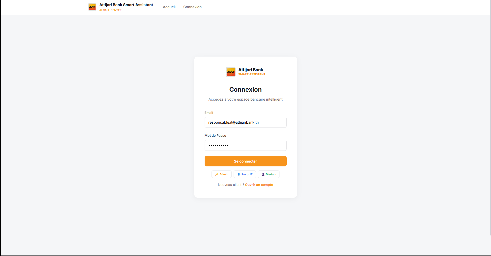
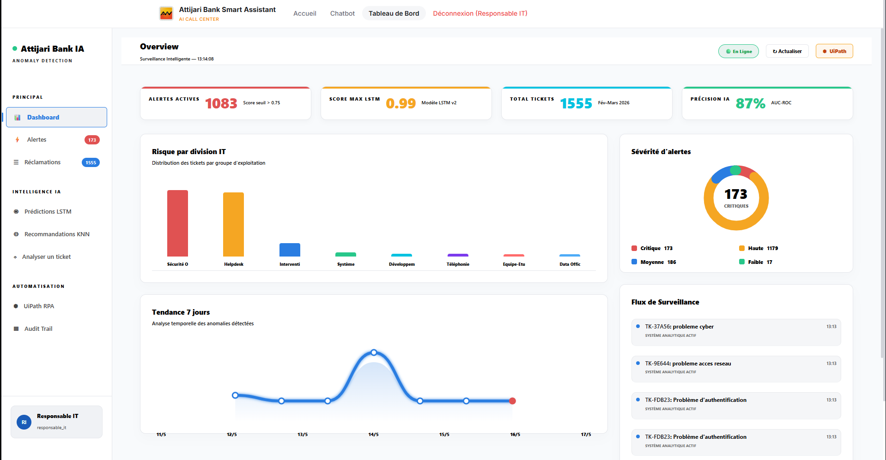
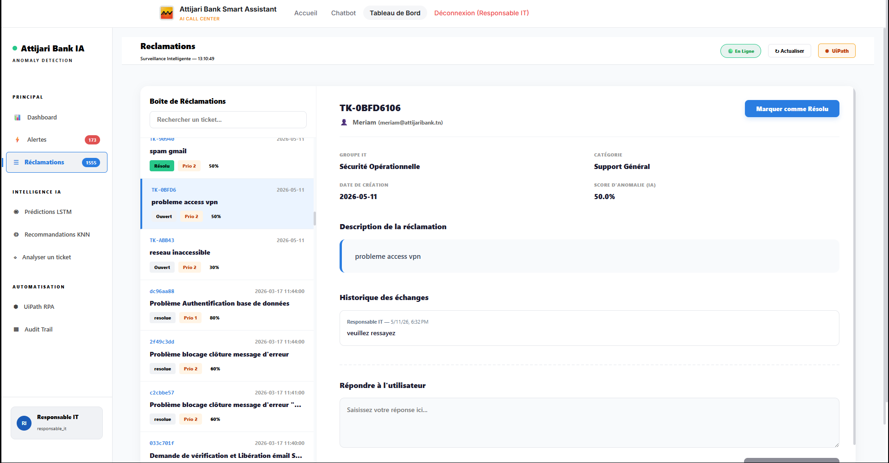
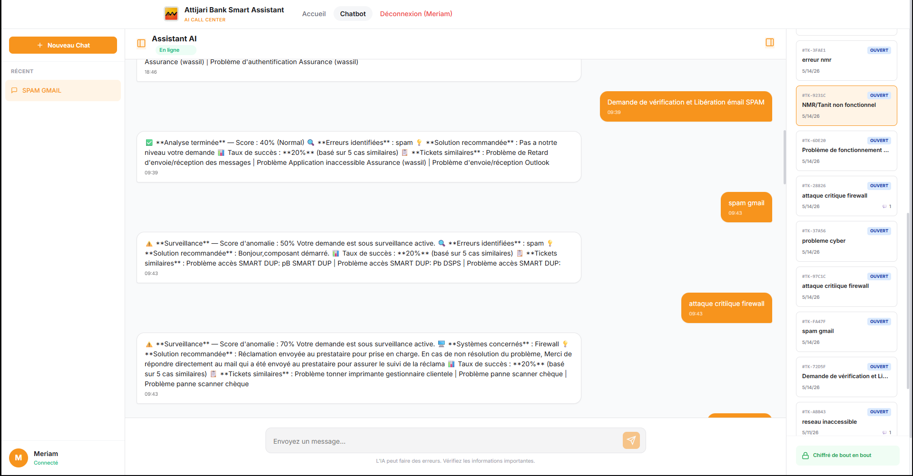
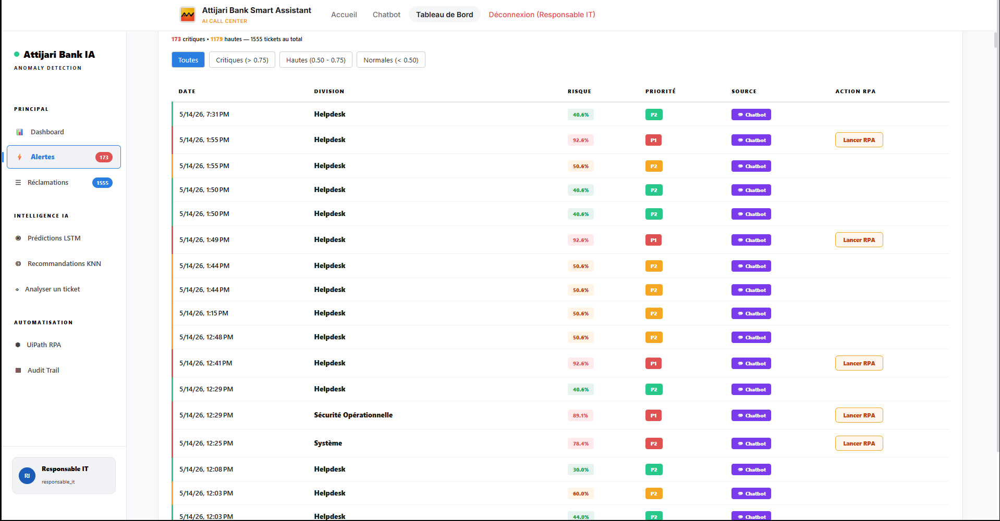

<p align="center">
  
</p>

<h1 align="center">Attijari Smart Assistant</h1>

<p align="center">
  <strong>AI-Powered IT Anomaly Detection & RPA Automation System</strong>
</p>

<p align="center">
  <em>Final Year Project (PFE) — Software Engineering — 2025/2026</em>
</p>

<p align="center">
  
  
  
  
  
  
  
</p>

---

## 📋 About

**Attijari Smart Assistant** is an intelligent IT ticket management system built for **Attijari Bank Tunisia**. It combines **Deep Learning (LSTM)**, **Machine Learning (KNN)**, **Natural Language Processing (NLP)**, and **Robotic Process Automation (UiPath)** to detect anomalies, predict IT incidents, and automate resolution workflows.

The system processes **1,507 real IT tickets** (Feb–Mar 2026) to provide predictive analytics, smart recommendations, and automated alerting — reducing mean resolution time and improving IT operational efficiency.

Important:
The backend is located in the "project folder", please ignore the folder named "backend"

---

## ✨ Key Features

| Feature | Description |
|---------|-------------|
| 🧠 **LSTM Anomaly Detection** | Deep learning model (91.3% accuracy) predicts IT incident risk scores per group |
| 🔍 **KNN Recommendation Engine** | Suggests resolution actions based on semantic similarity with historical tickets (TF-IDF + cosine) |
| 💬 **AI Chatbot** | NLP-powered conversational interface for ticket analysis and natural language queries |
| 🤖 **UiPath RPA Automation** | Automated workflows: alert checking → IT notification → resolution confirmation |
| 📊 **Real-time Dashboard** | Interactive Chart.js visualizations: trends, priorities, SLA tracking, heatmaps |
| 📬 **Smart Ticket Inbox** | Full ticket lifecycle management with status tracking and email notifications |
| 🔒 **Enterprise Security** | JWT authentication, AES-256 encryption, bcrypt hashing, role-based access control |
| 📝 **Audit Trail** | Complete logging of all user actions for banking compliance |
| ⏰ **Auto-Retraining** | Scheduled weekly model retraining (APScheduler — every Monday at 02:00) |

---

## 🖼️ Screenshots

<table>
  <tr>
    <td align="center"><br/><b>Login</b></td>
    <td align="center"><br/><b>Dashboard</b></td>
  </tr>
  <tr>
    <td align="center"><br/><b>Ticket Management</b></td>
    <td align="center"><br/><b>AI Chatbot</b></td>
  </tr>
  <tr>
    <td align="center"><br/><b>AI Alerts</b></td>
    <td align="center"><br/><b>Audit Trail</b></td>
  </tr>
</table>

---

## 🏗️ Architecture

```
┌─────────────────────────────────────────────────────────────┐
│                     Frontend (Angular 19)                   │
│              Login · Dashboard · Chat · Tickets             │
└──────────────────────────┬──────────────────────────────────┘
                           │ HTTP/REST + JWT
┌──────────────────────────▼──────────────────────────────────┐
│                   Backend (FastAPI + Python)                 │
│  ┌──────────┐  ┌──────────┐  ┌──────────┐  ┌────────────┐  │
│  │   Auth   │  │  Tickets │  │  Alerts  │  │   Audit    │  │
│  │  (JWT)   │  │  (CRUD)  │  │ (UiPath) │  │  (Trail)   │  │
│  └──────────┘  └──────────┘  └──────────┘  └────────────┘  │
│  ┌─────────────────────────────────────────────────────┐    │
│  │              AI / ML Engine                         │    │
│  │  LSTM (TensorFlow) · KNN (scikit-learn) · NLP      │    │
│  └─────────────────────────────────────────────────────┘    │
└──────┬──────────────┬────────────────────┬──────────────────┘
       │              │                    │
  ┌────▼────┐   ┌─────▼─────┐    ┌────────▼────────┐
  │PostgreSQL│   │   Redis   │    │  Elasticsearch  │
  │  (Data)  │   │  (Cache)  │    │  (NLP Search)   │
  └─────────┘   └───────────┘    └─────────────────┘
                                          │
                          ┌───────────────▼───────────────┐
                          │     UiPath RPA Workflows      │
                          │  CheckAlerte · NotifierIT ·   │
                          │    ConfirmerResolution         │
                          └───────────────────────────────┘
```

---

## 📂 Project Structure

```
attijari-pfe/
│
├── frontend/                      # Angular 19 SPA
│   └── src/app/
│       ├── pages/                 # Login, Dashboard, Chat, Register, Home
│       ├── services/              # API, Auth, Chat services
│       ├── components/            # Reusable UI components
│       ├── auth.guard.ts          # Route protection
│       └── role.guard.ts          # Role-based access
│
├── project/                       # Backend + AI + RPA
│   ├── app/
│   │   ├── main.py                # FastAPI entry point + lifecycle
│   │   ├── core/                  # Config, DB, Security, Scheduler, Logging
│   │   ├── models/                # SQLAlchemy ORM (User, Ticket, AuditLog)
│   │   ├── routers/               # API endpoints (6 modules)
│   │   └── services/              # NLP + KNN recommendation engine
│   │
│   ├── models/                    # Trained ML models
│   │   ├── lstm_model.h5          # LSTM neural network (TensorFlow)
│   │   ├── knn_model.pkl          # KNN classifier + TF-IDF vectorizer
│   │   ├── scaler_lstm.pkl        # StandardScaler for LSTM
│   │   └── metriques_lstm.json    # Model metrics (accuracy: 91.3%)
│   │
│   ├── scripts/                   # Data pipeline & training scripts
│   │   ├── entrainer_lstm.py      # LSTM training pipeline
│   │   ├── recommandations_knn.py # KNN training pipeline
│   │   ├── pipeline_nlp.py        # Full NLP pipeline
│   │   ├── import_csv.py          # Data import (1507 tickets)
│   │   └── init_db.py             # Database initialization
│   │
│   ├── uipath/                    # RPA workflows
│   │   ├── Main.xaml              # Orchestrator
│   │   ├── CheckAlerte.xaml       # Poll API for critical alerts
│   │   ├── NotifierIT.xaml        # Email notification to IT
│   │   └── ConfirmerResolution.xaml # Close resolved tickets
│   │
│   ├── docker-compose.yml         # PostgreSQL + Redis + Elasticsearch + MLflow
│   └── requirements.txt           # Python dependencies
│
├── rapport_final/                 # Final report + documentation
├── diagrammes/                    # UML & architecture diagrams
└── poster.pdf                     # Conference-style project poster
```

---

## 🚀 Getting Started

### Prerequisites

- **Python 3.11+**
- **Node.js 18+ LTS** (with npm)
- **Docker Desktop** (for infrastructure services)
- **UiPath Studio** (optional, for RPA workflows)

### 1. Infrastructure (Docker)

```bash
cd project
docker-compose up -d
```

This starts: PostgreSQL (5432) · Redis (6379) · Elasticsearch (9200) · MLflow (5000)

### 2. Backend (FastAPI)

```bash
cd project

# Create & activate virtual environment
python -m venv venv
venv\Scripts\activate        # Windows
# source venv/bin/activate   # macOS/Linux

# Install dependencies
pip install -r requirements.txt

# Configure environment
copy .env.example .env       # Edit .env if needed

# Initialize database & import data
python scripts/init_db.py
python scripts/import_csv.py

# Start the API server
uvicorn app.main:app --reload
```

API available at **http://localhost:8000** · Swagger docs at **http://localhost:8000/docs**

### 3. Frontend (Angular)

```bash
cd frontend
npm install
npm start
```

App available at **http://localhost:4200**

---

## 🔑 Test Accounts

| Role | Email | Password |
|------|-------|----------|
| **Admin** | `admin@attijaribank.tn` | `Admin@2026!` |
| **IT Manager** | `responsable.it@attijaribank.tn` | `Resp@2026!` |
| **User** | `meriam@attijaribank.tn` | `Stage@2026!` |
| **RPA Robot** | `robot@attijaribank.tn` | `Robot@2026!` |

---

## 🔌 API Endpoints

<details>
<summary><b>Authentication</b></summary>

| Method | Endpoint | Description |
|--------|----------|-------------|
| POST | `/auth/login` | Login — returns JWT token |
| GET | `/auth/me` | Get current user info |
| POST | `/auth/logout` | Logout — revokes JWT |

</details>

<details>
<summary><b>Tickets & AI Analysis</b></summary>

| Method | Endpoint | Description |
|--------|----------|-------------|
| GET | `/reclamations/` | List all 1507 tickets (with filters) |
| GET | `/reclamations/stats` | Dashboard statistics (Chart.js) |
| GET | `/reclamations/{id}` | Ticket details |
| POST | `/reclamations/analyser` | NLP analysis + anomaly score |

</details>

<details>
<summary><b>LSTM Predictions</b></summary>

| Method | Endpoint | Description |
|--------|----------|-------------|
| GET | `/api/predictions/` | Risk scores by group |
| POST | `/api/predictions/predire` | Predict score for a ticket |
| GET | `/api/predictions/dashboard` | Chart.js data |
| GET | `/api/predictions/modele` | LSTM model info & metrics |

</details>

<details>
<summary><b>KNN Recommendations</b></summary>

| Method | Endpoint | Description |
|--------|----------|-------------|
| GET | `/api/recommandations/` | List recommendations |
| POST | `/api/recommandations/analyser` | Get recommendation for text |
| GET | `/api/recommandations/{id}` | Recommendation for a ticket |
| POST | `/api/recommandations/{id}/valider` | Accept/reject recommendation |

</details>

<details>
<summary><b>Alerts (UiPath RPA)</b></summary>

| Method | Endpoint | Description |
|--------|----------|-------------|
| GET | `/api/alertes/` | Active alerts (configurable threshold) |
| GET | `/api/alertes/stats` | Alert statistics |
| POST | `/api/alertes/{id}/cloturer` | Confirm resolution (UiPath) |

</details>

<details>
<summary><b>Audit Trail</b></summary>

| Method | Endpoint | Description |
|--------|----------|-------------|
| GET | `/api/audit/` | Full action history |
| GET | `/api/audit/stats` | Audit statistics |

</details>

---

## 🧪 AI/ML Models

### LSTM — Anomaly Detection
- **Architecture**: LSTM neural network (TensorFlow/Keras)
- **Training data**: 1,200 tickets (train) / 300 tickets (test)
- **Accuracy**: **91.3%**
- **Window**: 7-day sliding window
- **Retraining**: Automatic weekly (Monday 02:00 via APScheduler)

### KNN — Resolution Recommender
- **Algorithm**: K-Nearest Neighbors with TF-IDF vectorization
- **Similarity**: Cosine similarity on ticket descriptions
- **Output**: Top-K similar resolved tickets with recommended actions

---

## 🤖 RPA Workflows (UiPath)

| Workflow | Description |
|----------|-------------|
| `Main.xaml` | Orchestrator — runs the full automation pipeline |
| `CheckAlerte.xaml` | Polls `GET /api/alertes?seuil=0.75` for critical alerts |
| `NotifierIT.xaml` | Sends email notification to IT manager |
| `ConfirmerResolution.xaml` | Calls `POST /api/alertes/{id}/cloturer` to close resolved tickets |

---

## 🛡️ Security

- **Authentication**: JWT tokens with configurable expiration
- **Password Hashing**: bcrypt with automatic salting
- **Data Encryption**: AES-256 for sensitive fields
- **RBAC**: Role-based access control (Admin, IT Manager, User, Robot)
- **Audit Trail**: Every action logged for banking compliance
- **CORS**: Restricted to whitelisted origins

---

## 🐳 Docker Services

```bash
docker-compose up -d    # Start all services
docker-compose ps       # Check status
```

| Service | Port | Purpose |
|---------|------|---------|
| PostgreSQL | 5432 | Primary data storage |
| Redis | 6379 | Caching & background tasks |
| Elasticsearch | 9200 | NLP ticket search & indexing |
| MLflow | 5000 | ML experiment tracking |

---

## 📊 Data

- **Source**: Real IT tickets from Attijari Bank Tunisia
- **Volume**: 1,507 tickets (February–March 2026)
- **Fields**: Group, priority, category, status, description, resolution time, SLA compliance
- **Processing**: Full NLP pipeline (tokenization, lemmatization, TF-IDF, BERT embeddings)

---

## 🛠️ Tech Stack

| Layer | Technologies |
|-------|-------------|
| **Frontend** | Angular 19, TypeScript, Chart.js, CSS3 |
| **Backend** | Python 3.11, FastAPI, SQLAlchemy, Pydantic |
| **AI/ML** | TensorFlow (LSTM), scikit-learn (KNN), spaCy, TF-IDF |
| **RPA** | UiPath Studio |
| **Database** | PostgreSQL 15, Redis, Elasticsearch |
| **DevOps** | Docker Compose, MLflow |
| **Security** | JWT, bcrypt, AES-256 |
| **Logging** | Loguru |

---

## 👩‍💻 Team

| Member | Role |
|--------|------|
| **Meriam** | Backend · AI/ML · NLP · Data Engineering · RPA · Security |
| **Partner** | Frontend · UI/UX · Dashboard |

**Supervisor**: Attijari Bank Tunisia  
**Institution**: SESAME University — Software Engineering  
**Academic Year**: 2025–2026  
**Grade**: **14.5 / 20** ✅

---

## 📄 License

This project was developed as an academic Final Year Project (PFE) for Attijari Bank Tunisia. All rights reserved.
