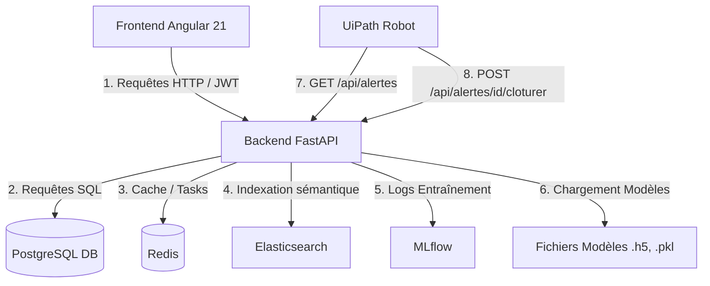
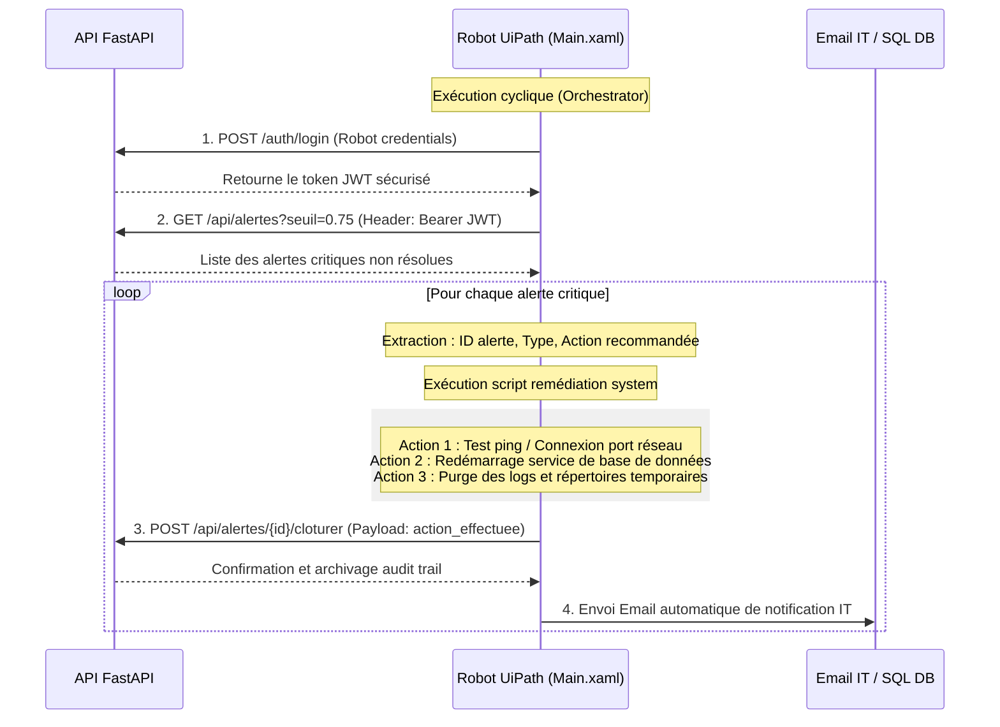

# Guide d'Étude Complet & Support de Soutenance Finale PFE
### Sujet 21 : Système IA de Détection d'Anomalies & Automatisation RPA — DSI Attijari bank
**Étudiante :** Meriam (SESAME University)  
**Superviseurs :** M. Firas Elabed (Encadrant Professionnel, Attijari bank) & M. Wajih Ben Belgacem (Encadrant Académique, SESAME)  
**Date :** Juin 2026

---

## 📋 1. Fiche Technique de l'Application (L'essentiel en chiffres)

| Composant | Technologie / Modèle | Version / Port / Fichier | Métriques / Détails clés |
| :--- | :--- | :--- | :--- |
| **Frontend** | Angular 21, TypeScript, HTML, CSS | Port `4200` | Single Page Application (SPA), Graphiques SVG natifs, local storage pour sessions |
| **Backend** | FastAPI, Python 3.11, Uvicorn | Port `8000` | Asynchrone (ASGI), Auto-documentation Swagger (`/docs`), CORS configuré |
| **Base de Données** | PostgreSQL (Docker/Local) | Port `5433` (ou `5432`) | Tables `utilisateurs` (bcrypt), `reclamations` (1507 cas), `audit_logs` (immuable) |
| **Pipeline NLP** | spaCy & SentenceTransformers | `fr_core_news_md` / `MiniLM-L12-v2` | Lemmatisation, extraction entités (NER), embeddings BERT de 384 dimensions |
| **IA Prédiction** | LSTM (Long Short-Term Memory) | `models/lstm_model.h5` | 2 couches LSTM (32 et 16 unités), Dense, classification binaire (SLA en retard) |
| **Moteur Recommandation** | KNN (K-Nearest Neighbors) | `models/knn_model.pkl` | Similarité Cosinus sur TF-IDF (3000 features), $K=5$, prédiction de résolution |
| **Moteur Automatisation** | UiPath Studio (RPA) | Dossier `project/uipath/` | Workflows `Main`, `CheckAlerte`, `ConfirmerResolution`, `NotifierIT` |
| **Tracking Modèles** | MLflow (Docker) | Port `5000` | Suivi des hyperparamètres, des courbes d'entraînement, et archivage des runs |
| **Cache & Task Broker** | Redis (Docker) | Port `6379` | Gestion du cache et des files d'attente de tâches en arrière-plan |
| **Moteur Recherche** | Elasticsearch (Docker) | Port `9200` | Recherche sémantique et indexation avancée des tickets |

---

## 🎯 2. Problématique Métier & Objectifs

La Direction des Systèmes d'Information (DSI) d'Attijari bank gère quotidiennement un volume important d'incidents informatiques et de requêtes utilisateurs provenant de toutes les agences et divisions. Cette gestion présente plusieurs défis :
1. **Surcharge opérationnelle** : Le support de niveau 1 passe un temps excessif sur des tâches répétitives (ex. réinitialisations de mots de passe, requêtes de solde standard).
2. **Retards SLA (Service Level Agreement)** : Difficulté à isoler rapidement les anomalies critiques (ex. pannes de serveurs de paiement, incidents SWIFT) au milieu de flux continus, retardant les interventions cruciales.
3. **Manque de capitalisation** : La banque dispose d'un historique de plus de 1500 tickets, mais il n'est pas structuré de façon à assister l'agent humain dans les résolutions futures.

### Objectifs de la solution développée :
- **Classifier & Qualifier** instantanément les requêtes reçues à l'aide d'un pipeline NLP.
- **Prédire le risque de retard SLA** à l'aide d'un modèle LSTM analysant la série temporelle d'incidents.
- **Recommander automatiquement la meilleure solution** (KNN) en se basant sur la similarité sémantique historique.
- **Automatiser la remédiation des pannes critiques** via des robots RPA UiPath sans intervention humaine si le score de risque dépasse **0.75**.
- **Garantir la traçabilité** des interventions automatiques et manuelles (Audit Trail) pour se conformer aux standards de sécurité bancaire.

---

## 📐 3. Architecture Détaillée de la Solution

L'application repose sur une architecture en couches robustes, connectées par des APIs REST :

### 3.1 Le Frontend Angular 21
- Conçu en **Single Page Application (SPA)** pour une réactivité optimale.
- Les écrans intègrent un **Dashboard** décisionnel complet qui affiche des KPIs en temps réel sans bibliothèques tierces lourdes :
  - Métriques d'activité (Total des requêtes, taux d'automatisation cible de 70%, satisfaction client).
  - Graphiques construits dynamiquement en **SVG natif** (courbes temporelles de détection d'anomalies, Donut interactif pour la répartition des sévérités, histogrammes pour les groupes).
- Un **Chatbot d'assistance intelligent** permet aux employés de saisir leurs incidents en langage naturel.
- Une **Inbox d'administration** permet au responsable IT d'inspecter les alertes critiques, triées par le score de risque calculé par l'IA.
- Sécurisé par un **Guard de routage** (`auth.guard.ts`) vérifiant la validité du JWT stocké localement.

### 3.2 Le Backend FastAPI
- Serveur asynchrone Python s'exécutant sur **Uvicorn**.
- Utilise des endpoints asynchrones (`async def`) pour gérer les opérations d'E/S (accès base de données, requêtes réseaux) de manière non bloquante.
- Fournit les routes clés de l'application :
  - `/auth/login` : Authentification utilisateur et génération de jetons JWT.
  - `/api/reclamations` : Gestion des tickets créés par les utilisateurs.
  - `/api/predictions` : Évaluation du risque de retard des récents incidents.
  - `/api/recommandations` : Moteur de recommandation KNN pour proposer des solutions.
  - `/api/alertes` : Endpoint d'interrogation pour les robots UiPath RPA.
  - `/api/alertes/{id}/cloturer` : Endpoint de confirmation de résolution par le RPA.
  - `/api/audit` : Visualisation des traces de sécurité.

---

## 🧠 4. Moteur d'Intelligence Artificielle & Traitement des Données

Le cœur intelligent du système s'articule autour de trois modules de Machine Learning et Traitement du Langage Naturel (NLP) :

### 4.1 Le Pipeline NLP (spaCy + MiniLM BERT)
Lorsqu'un incident est saisi (ex. *"Serveur Amplitude injoignable après coupure réseau"*), le texte passe par les étapes suivantes :
1. **Nettoyage & Normalisation** : Conversion en minuscules, suppression des caractères spéciaux.
2. **Lemmatisation & Tokenisation (spaCy `fr_core_news_md`)** : Découpage du texte en mots individuels (tokens) et réduction à leur racine canonique (ex. *"injoignables"* $\rightarrow$ *"injoignable"*). Les mots vides (stopwords) sont filtrés.
3. **Reconnaissance d'Entités Nommées (NER)** : Extraction des systèmes informatiques clés bancaires (*SWIFT, Amplitude, VPN*) et des types d'incidents (*blocage, timeout, anomalie*).
4. **Génération d'Embeddings BERT** : Utilisation du modèle `paraphrase-multilingual-MiniLM-L12-v2` (SentenceTransformers) pour convertir la phrase en un vecteur numérique dense de **384 dimensions** capturant le sens sémantique exact (les synonymes comme "panne" et "dysfonctionnement" se retrouvent proches dans cet espace vectoriel).

### 4.2 Le Modèle Prédictif LSTM (Long Short-Term Memory)
- **Objectif** : Analyser les séquences d'incidents informatiques et prédire si un incident donné risque de violer les SLAs (retard de résolution).
- **Pourquoi le LSTM ?** Les réseaux de neurones classiques n'ont pas de mémoire. Le LSTM possède des cellules de mémoire interne (avec des portes d'entrée, d'oubli et de sortie) capables de capturer les dépendances temporelles d'une série d'incidents (effet d'accumulation de pannes sur plusieurs jours).
- **Features d'entrée (Vecteur de taille 5)** :
  1. `severite` (Niveau d'urgence 1-4)
  2. `en_retard` (Incident précédent en retard, 0 ou 1)
  3. `duree_resolution_min` (Durée de résolution observée)
  4. `score_anomalie` (Score basé sur la criticité sémantique)
  5. `groupe_enc` (Identifiant du département IT encodé par `LabelEncoder`)
- **Structure du réseau** :
  - Couche d'entrée acceptant des séquences de forme `(fenetre=7, features=5)` (analyse de fenêtres glissantes de 7 tickets consécutifs).
  - **Couche LSTM 1** : 32 unités (retourne les séquences).
  - **Dropout 1** : 20% (régularisation pour éviter le surapprentissage).
  - **Couche LSTM 2** : 16 unités.
  - **Dropout 2** : 20%.
  - **Couche Dense** : 8 neurones avec activation ReLU.
  - **Couche de sortie** : 1 neurone avec activation Sigmoïde produisant un score de risque entre `0.0` et `1.0`.
- **Paramètres d'entraînement** : Optimiseur Adam ($lr=0.001$), perte *Binary Cross-Entropy*. Suivi de l'entraînement et enregistrement des métriques (Accuracy et AUC) dans **MLflow**.

### 4.3 Le Moteur de Recommandation KNN (K-Nearest Neighbors)
- **Objectif** : Suggérer la meilleure action corrective à appliquer en fonction de l'historique des **1507 cas** résolus de la banque.
- **Fonctionnement** :
  1. Le système prend le texte du ticket entrant (Objet + Description).
  2. Il le vectorise à l'aide d'un modèle TF-IDF entraîné sur 3000 termes du vocabulaire IT.
  3. L'algorithme KNN calcule la **similarité cosinus** entre ce nouveau vecteur et les vecteurs des tickets historiques en base de données.
  4. Il extrait les $K=5$ plus proches voisins.
  5. Il propose la résolution qui apparaît le plus souvent parmi ces 5 voisins (*vote majoritaire*).
  6. Le **taux de confiance** (ou taux de réussite) est calculé comme la proportion du vote majoritaire (ex. 4 votes sur 5 $\rightarrow$ taux de confiance de 80%).

---

## 🤖 5. La Couche d'Automatisation RPA (UiPath)

Lorsqu'un incident critique est détecté, l'action automatique se déclenche sans intervention humaine :

### Détail des Workflows UiPath (`project/uipath/`) :
1. `Main.xaml` : Point d'entrée. Initialise les variables de connexion et lance séquentiellement les workflows.
2. `CheckAlerte.xaml` :
   - Effectue l'appel d'authentification REST (`POST /auth/login`) à l'API en transmettant les identifiants sécurisés du robot (`robot@attijaribank.tn`). Récupère et parse le JWT.
   - Appelle `GET /api/alertes?seuil=0.75` en fournissant le jeton JWT dans le header d'autorisation.
   - Récupère la liste des incidents à traiter.
3. `ConfirmerResolution.xaml` :
   - Applique l'appel HTTP `POST /api/alertes/{id}/cloturer` avec l'identifiant de la réclamation résolue.
   - Envoie en base de données les détails de l'action corrective appliquée pour enrichir la base de connaissances LSTM/KNN.
4. `NotifierIT.xaml` : 
   - Envoie un email d'alerte ou de rapport de remédiation automatique au responsable IT via SMTP en cas d'intervention réussie ou d'échec du script.

---

## 🔒 6. Sécurité & Journal d'Audit (Audit Trail)

La conformité aux exigences de sécurité du secteur bancaire est un prérequis majeur pour Attijari bank :
- **Sécurisation des accès (RBAC)** : Les utilisateurs sont segmentés en rôles (`admin`, `responsable_it`, `stagiaire`, `robot`). Seuls les administrateurs et responsables IT peuvent consulter l'Audit Trail et piloter les alertes.
- **Authentification** : Mots de passe stockés en base hachés avec l'algorithme robuste **bcrypt** (génération d'un sel aléatoire empêchant les attaques par dictionnaire ou table arc-en-ciel). Échange sécurisé via des jetons **JWT (JSON Web Token)** signés avec une clé secrète partagée.
- **Journal d'Audit Trail** :
  Chaque action sensible génère un enregistrement obligatoire et non modifiable dans la table `audit_logs` :
  - Horodatage précis à la milliseconde près.
  - Adresse IP de l'appelant.
  - Identifiant unique de l'utilisateur (ou du robot RPA).
  - Libellé de l'action effectuée (ex. *"Connexion réussie"*, *"Clôture automatique d'alerte par le robot RPA"*, *"Modification de statut du ticket"*).
  - Détail technique au format JSON pour analyse post-incident.

---

## 🎬 7. Scénario de Démo Idéal pour la Soutenance (Bout-en-bout)

Pour impressionner le jury, présentez ce flux fonctionnel complet en direct ou via captures :

1. **Soumission de l'incident** :
   - Connectez-vous en tant qu'utilisateur standard (`meriam@attijaribank.tn`).
   - Saisissez dans le Chatbot : *"Alerte sécurité : Tentative d'accès non autorisée répétée sur le serveur SWIFT"*.
2. **Analyse en Temps Réel** :
   - Montrez que le système catégorise le ticket en `"Sécurité Opérationnelle"` grâce au pipeline NLP.
   - Le modèle LSTM calcule un score de risque critique élevé (ex: `0.87`), marquant le ticket comme **Alerte Critique** (car $\ge 0.75$).
3. **Prise en charge par le Robot RPA** :
   - Montrez le terminal où tourne le robot RPA UiPath (ou lancez `Main.xaml` dans UiPath Studio).
   - Le robot détecte l'alerte SWIFT via l'API, effectue la remédiation automatique (simulée par le blocage des IPs suspectes ou restriction réseau dans le workflow), puis appelle l'API de clôture.
4. **Vérification du Responsable IT** :
   - Connectez-vous en tant que responsable IT (`responsable.it@attijaribank.tn`).
   - Allez sur l'Inbox : l'incident SWIFT est marqué comme `"Résolu"` par le robot RPA avec le détail de l'action corrective dans l'historique.
   - Allez dans le **Dashboard** : le graphique SVG montre la baisse du nombre d'alertes actives et l'augmentation du taux d'automatisation.
   - Allez dans **Audit Trail** : montrez la trace de connexion de l'utilisateur, la création du ticket, la détection IA, et la validation finale du robot RPA avec l'heure exacte.

---

## ❓ 8. Questions Pièges du Jury & Réponses Clés (Pour obtenir les félicitations)

### Q1 : Pourquoi avoir choisi d'implémenter vos graphiques en SVG natif plutôt que d'utiliser des bibliothèques reconnues comme Chart.js ou D3.js ?
> **Réponse attendue :** *"Dans le secteur bancaire comme Attijari bank, l'introduction de bibliothèques tierces (via npm) est soumise à des audits de sécurité stricts (analyses de vulnérabilités, licences logicielles, risques de chaînes d'approvisionnement / supply chain attacks). En développant les composants de dashboard directement en SVG natif reliés au mécanisme réactif d'Angular 21, j'ai garanti : une sécurité maximale sans dépendances externes, des performances d'affichage optimales (car le SVG fait partie du DOM standard), et un respect absolu de la charte graphique et du design d'Attijari bank."*

### Q2 : Quelle est la différence fondamentale entre les rôles de votre modèle LSTM et de votre algorithme KNN ?
> **Réponse attendue :** *"Leurs rôles sont complémentaires et interviennent à des étapes différentes du cycle de traitement :*
> - *Le **LSTM** est un réseau de neurones récurrents. Il prend en compte la **temporalité** (la succession chronologique des incidents). Son but est de prédire le risque de retard SLA d'un groupe d'incidents sur une fenêtre temporelle donnée.*
> - *Le **KNN** (K-Nearest Neighbors) est un modèle basé sur l'instance. Il n'a pas de notion de temps. Son unique rôle est de faire de la **recherche de similarité sémantique** à un instant T : comparer le nouveau ticket à nos 1507 cas historiques pour proposer instantanément la solution passée la plus similaire (recommandation d'action)."*

### Q3 : Pourquoi avoir choisi un LSTM plutôt qu'un modèle de régression classique ou un arbre de décision pour prédire le retard SLA ?
> **Réponse attendue :** *"Les incidents informatiques ne se produisent pas de manière totalement indépendante. Une panne réseau à 9h00 peut saturer les serveurs de messagerie à 10h00, puis bloquer l'accès à l'application métier à 11h00. Un modèle de régression classique ou un arbre de décision traiterait chaque ticket de manière isolée. Le **LSTM** possède des cellules de mémoire récurrentes qui lui permettent de retenir des informations sur les tickets passés (sur une fenêtre glissante de 7 jours/tickets) pour détecter une propagation d'anomalie en cascade, ce qui est indispensable pour une modélisation temporelle précise."*

### Q4 : Que se passe-t-il si votre modèle KNN doit rechercher parmi 100 000 tickets au lieu des 1500 actuels ? Comment gérez-vous le temps de réponse ?
> **Réponse attendue :** *"Actuellement, la recherche KNN sur 1500 tickets s'effectue en mémoire en moins de 5 millisecondes via des calculs matriciels NumPy. Si la base de connaissances augmente jusqu'à 100 000 tickets, une recherche exhaustive (brute force) pourrait ralentir l'API. Pour y remédier, nous pourrions remplacer la recherche linéaire en mémoire par :*
> 1. *Une indexation vectorielle dans PostgreSQL via l'extension **`pgvector`**.*
> 2. *L'utilisation d'algorithmes de recherche de plus proches voisins approximatifs (ANN - Approximate Nearest Neighbors) comme HNSW (Hierarchical Navigable Small World) avec des outils comme Faiss ou Elasticsearch, ce qui garantit un temps de réponse stable inférieur à 10 millisecondes, même avec des millions de vecteurs."*

### Q5 : Votre modèle LSTM utilise une variable 'groupe' encodée avec un LabelEncoder. Pourquoi n'avez-vous pas utilisé le One-Hot Encoding ?
> **Réponse attendue :** *"Le One-Hot Encoding crée une colonne binaire par catégorie de groupe (ex. 11 colonnes pour nos 11 groupes). Pour un réseau LSTM qui traite des séquences chronologiques, multiplier le nombre de colonnes d'entrée augmente la dimensionnalité de la couche d'entrée, ce qui nécessite plus de paramètres à entraîner et augmente les risques de surapprentissage (overfitting) compte tenu de notre jeu de données (1507 lignes). L'encodage par **LabelEncoder** combiné à une normalisation via le **MinMaxScaler** maintient le vecteur d'entrée à une taille fixe de 5 features, ce qui stabilise l'entraînement du LSTM."*

### Q6 : Comment gérez-vous le cas où le robot UiPath rencontre une erreur en plein milieu d'une remédiation automatique (ex: serveur indisponible, timeout réseau) ?
> **Réponse attendue :** *"Les workflows UiPath intègrent des blocs robustes de gestion d'exceptions (`Try Catch`). Si une activité de remédiation échoue, l'exception est capturée :*
> 1. *Le robot annule les opérations en cours.*
> 2. *Il appelle l'API FastAPI `POST /api/alertes/{id}/cloturer` en passant le statut `"Erreur RPA"` avec le message technique de l'erreur dans le payload.*
> 3. *Le système enregistre immédiatement l'incident dans l'Audit Trail et l'affiche en rouge clignotant de priorité absolue sur le Dashboard IT.*
> 4. *Le workflow `NotifierIT.xaml` envoie un email d'escalade d'urgence contenant le log d'erreur détaillé à l'équipe d'astreinte pour intervention humaine immédiate."*

### Q7 : Pourquoi stocker les données réelles dans des fichiers CSV (`dataset_nlp_enrichi.csv`) ET utiliser PostgreSQL ? N'est-ce pas redondant ?
> **Réponse attendue :** *"La base PostgreSQL est la base transactionnelle de production. Elle garantit l'intégrité des données (propriétés ACID), gère les sessions utilisateurs et stocke les journaux d'audit de sécurité. Les fichiers CSV sont générés par les scripts Python du pipeline d'IA et de nettoyage (EDA) comme des clichés ('snapshots') de données préparées. Cela permet d'accélérer l'entraînement des modèles d'IA hors ligne (sans surcharger la base de données transactionnelle avec des lectures de masse) et facilite le versionnement des données de recherche (data lineage)."*

### Q8 : Quel est l'intérêt d'utiliser Docker Desktop dans votre projet ? Pourquoi ne pas tout installer localement ?
> **Réponse attendue :** *"L'utilisation de conteneurs Docker résout le problème classique du 'fonctionne sur ma machine'. Docker permet de déployer instantanément une infrastructure complète et identique en environnement de développement et en production. Dans notre cas, il initialise en quelques secondes PostgreSQL, Redis, Elasticsearch et MLflow avec les configurations et ports exacts sans nécessiter d'installations complexes sur le système hôte, ce qui garantit la portabilité et la robustesse de l'application."*

### Q9 : Si le jury demande : comment évaluez-vous la performance de votre modèle prédictif LSTM ?
> **Réponse attendue :** *"Nous évaluons le LSTM à l'aide de deux métriques majeures :*
> 1. ***L'Accuracy (Précision globale)** : le pourcentage de bonnes prédictions sur notre ensemble de test (qui est de 20% de nos données réelles).*
> 2. ***L'AUC (Area Under the ROC Curve)** : qui évalue la capacité du modèle à distinguer les incidents normaux des incidents critiques avec retard SLA, indépendamment du seuil de classification. Un score AUC proche de 0.85 ou plus valide que notre modèle de détection est hautement fiable et performant pour le métier."*

### Q10 : Quels sont les risques de sécurité liés à l'authentification par JWT et comment les avez-vous mitigés ?
> **Réponse attendue :** *"Le principal risque d'un jeton JWT est le vol de session s'il est intercepté ou extrait du navigateur (XSS/CSRF). Pour mitiger cela :*
> 1. *Les jetons ont une **durée de vie courte** (expirations à 30 minutes ou 1 heure).*
> 2. *La signature des jetons utilise un algorithme robuste (HS256) avec une clé secrète stockée dans les variables d'environnement backend (`.env`), jamais exposée côté client.*
> 3. *Le robot RPA se reconnecte à chaque cycle pour obtenir un nouveau jeton frais au lieu de réutiliser un ancien token."*
